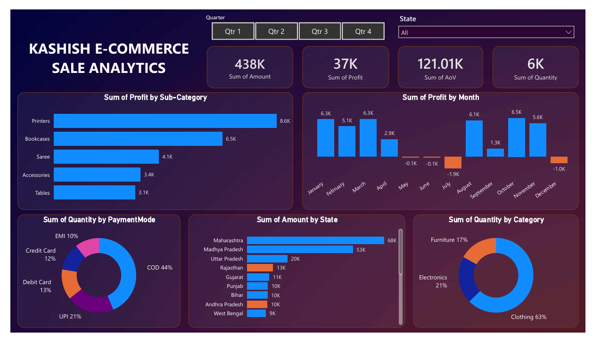

# 📊 Kashish E-Commerce Sales Analytics

An interactive **Power BI dashboard** built to analyze and monitor the online sales performance of **Kashish E-Commerce Store** across India. The dashboard provides valuable business insights into sales, profitability, customer purchasing behavior, product performance, and regional trends to support data-driven decision-making.

---

## 🎯 Business Objective

The objective of this project is to help the business:

- Monitor overall sales performance.
- Track revenue, profit, and quantity sold.
- Identify top-performing products and categories.
- Analyze sales across different states.
- Understand customer payment preferences.
- Discover monthly sales and profit trends.

---

## 📂 Dataset

The project is built using two CSV datasets:

- **Orders.csv** – Contains order and customer information.
- **Details.csv** – Contains transaction details such as sales amount, profit, quantity, category, sub-category, and payment mode.

These datasets are connected using **Order ID** to build the data model.

---

## 📊 Dashboard Features

The dashboard includes the following interactive components:

- KPI Cards (Sales, Profit, Quantity, Average Order Value)
- Quarterly and State Filters
- Profit by Sub-Category
- Monthly Profit Trend
- State-wise Sales Analysis
- Category-wise Quantity Distribution
- Payment Mode Analysis

---

## 💡 Key Insights

- Maharashtra generated the highest sales among all states.
- Printers emerged as the most profitable sub-category.
- Clothing contributed the highest sales quantity.
- Cash on Delivery (COD) was the most preferred payment method.
- Monthly profit showed seasonal fluctuations, including a few low-profit periods.

---

## 🛠 Tools & Technologies

- Microsoft Power BI
- Power Query
- Data Modeling
- Data Visualization

---

## 🧠 Skills Demonstrated

- Data Cleaning
- Data Transformation
- Data Modeling
- Interactive Dashboard Development
- KPI Design
- Business Intelligence
- Sales Analytics
- Data Storytelling

---

## 📸 Dashboard Preview

> *(Add your dashboard screenshot here)*



---

## 📁 Repository Contents

```text
📦 Kashish-Ecommerce-Sales-Analytics
├── Kashish_E-Commerce_Analysis.pbix
├── Orders.csv
├── Details.csv
├── Dashboard.png
├── Report.pdf
└── README.md
```

---

## 📄 Project Report

A detailed report covering the business problem, data preparation, dashboard development, insights, and recommendations is available in the **Report.pdf** file.

---

## 🚀 Conclusion

This project demonstrates how Power BI can transform raw sales data into meaningful business insights through interactive visualizations. The dashboard enables stakeholders to monitor key performance metrics, identify business opportunities, and support strategic decision-making.

---
## 👨‍💻 About the Author

Hi, I'm **Mohd Affan**, an aspiring **Data Analyst** with a passion for transforming raw data into meaningful insights through data analytics, visualization, and interactive dashboards. I enjoy building real-world projects that solve business problems using data-driven solutions.

I'm always open to feedback, collaboration, and new opportunities.

📧 **Email:** mohdaffan020@gmail.com 

💼 **LinkedIn:** www.linkedin.com/in/mohd-affan-0b61133a8
